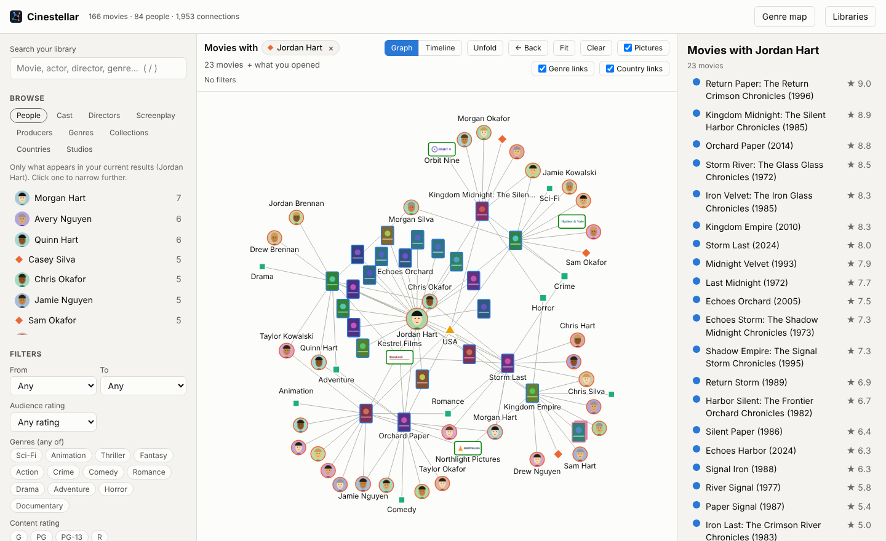
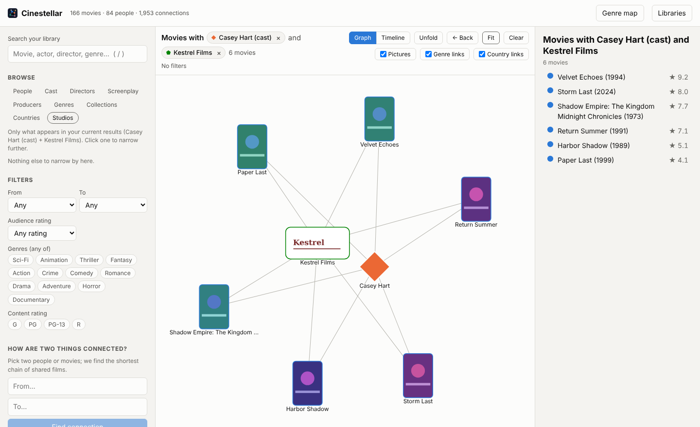
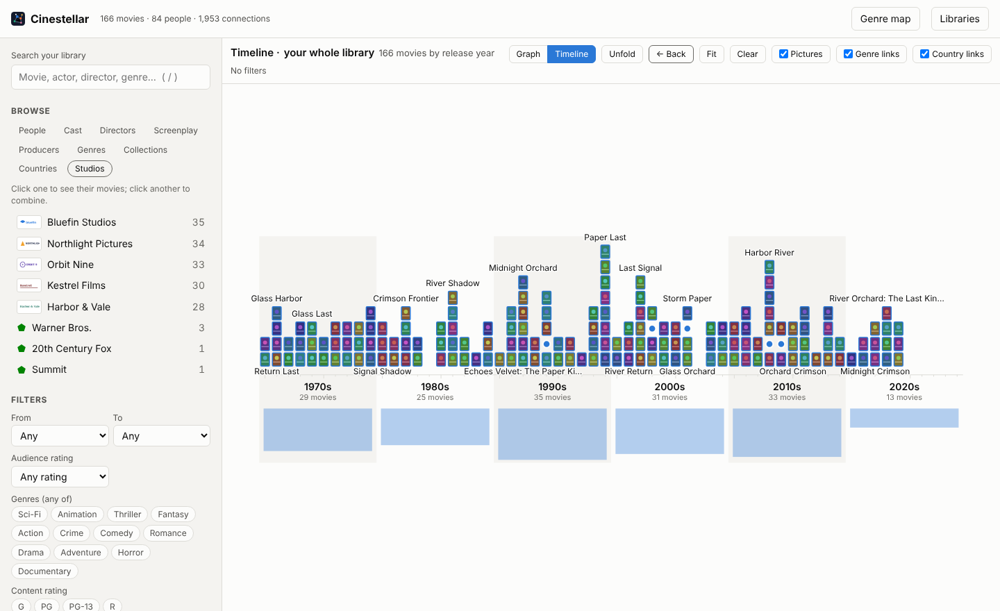

# Cinestellar

**Explore your Plex movie library as a graph.** Cinestellar reads the movie libraries you choose
from your own Plex Media Server into a graph database and serves a website on your network where
you can see how everything connects: who acted with whom, which directors keep working with the
same writers, which studio made which franchise, and how two films you love are linked.



[](https://github.com/009bob/cinestellar/actions/workflows/ci.yml)
[](LICENSE)

- Self-hosted, runs with Docker (Windows, macOS, Linux, Synology, Unraid, Raspberry Pi: Intel and ARM images).
- Bundles its own Neo4j Community Edition. No Neo4j license or setup needed.
- Movies only for now, one Plex server at a time.

> Cinestellar is a community project. It is not affiliated with or endorsed by Plex, Inc.

## Contents

- [What you can do](#what-you-can-do)
- [Install](#install)
- [Connect to Plex and import](#connect-to-plex-and-import)
- [Studio logos and franchises (TMDB, optional)](#studio-logos-and-franchises-tmdb-optional)
- [Updating](#updating)
- [Settings](#settings)
- [Security and privacy](#security-and-privacy)
- [Troubleshooting](#troubleshooting)
- [Graph model](#graph-model)
- [Development](#development)
- [License and credits](#license-and-credits)

## What you can do

- **Combine picks.** Click an actor, then a studio, and see only the films that have both. Add a
  genre or a director to narrow further (up to six). The bar above the graph always says exactly
  what you're looking at, with an × on each pick and filter.
- **Browse by role**: Cast, Directors, Screenplay and Producers, or everyone under People. A
  director picked from *Directors* means the films they directed, not the ones they only acted in.
- **Pictures**: box art for movies, posters for collections, photos for cast and crew (with the
  name underneath), logos for studios. Coloured shapes stand in while zoomed out.
- **Franchises**: Plex collections such as "Mission: Impossible Collection" are first-class nodes.
  With a free TMDB key, movies Plex never put in a collection are matched to their franchise too.
- **Timeline**: lay a career, a franchise or the whole library out by release year over decades.
- **Unfold**: watch the graph grow one ring of connections at a time.
- **How are two things connected?** The shortest chain of shared films between two people or movies.
- **More like this**: titles ranked by what they share (collection, director, writers, top-billed
  cast, genres), with the reason shown.
- **Plain-English links**: point at any line ("Keanu Reeves acted in The Matrix as Neo").
- **Filters** (decades, rating, genres, content rating), a **genre map**, **Genre/Country links**
  toggles to declutter, search with `/`, Back with Alt+←.





## Install

You need [Docker](https://docs.docker.com/get-docker/) with Compose (Docker Desktop on Windows and
macOS includes both) and a Plex Media Server with at least one movie library. 2 GB of free memory
is plenty for most libraries.

1. Make a folder (for example `cinestellar`) and download two files into it:

   **Linux / macOS**
   ```bash
   mkdir cinestellar && cd cinestellar
   curl -LO https://github.com/009bob/cinestellar/releases/latest/download/docker-compose.yml
   curl -L -o .env https://github.com/009bob/cinestellar/releases/latest/download/env.example
   ```

   **Windows (PowerShell)**
   ```powershell
   mkdir cinestellar; cd cinestellar
   curl.exe -LO https://github.com/009bob/cinestellar/releases/latest/download/docker-compose.yml
   curl.exe -L -o .env https://github.com/009bob/cinestellar/releases/latest/download/env.example
   ```

2. Open `.env` in a text editor and set `NEO4J_PASSWORD` to something of your own (8+
   characters). It protects the bundled database, which is never exposed outside Docker.
   Consider setting `APP_PASSWORD` too (see [Security](#security-and-privacy)).

3. Start it:
   ```bash
   docker compose up -d
   ```

4. Open `http://localhost:8080`, or `http://<that computer's IP>:8080` from another device. The
   first start can take a minute while Neo4j initialises; the page waits for it.

**NAS and home servers.** Synology (Container Manager → Project), Unraid (Compose Manager plugin),
TrueNAS, Portainer stacks and similar can use the same `docker-compose.yml` and `.env`. The image
is published for `linux/amd64` and `linux/arm64`.

## Connect to Plex and import

1. Click **Sign in with Plex**, approve Cinestellar on the plex.tv page that opens, and pick your
   server. No token to copy. Plex reports each server's current addresses, so if your server's
   LAN address changes later, Cinestellar finds it again by itself.
2. Tick the movie libraries you want and click **Import selected**. A library of a thousand movies
   takes a few minutes.

You can also enter the server address and token yourself (*Or enter the server address and token
yourself*). The quickest way: in Plex Web open any movie, choose **Get Info → View XML**, and paste
the address of the page that opens; Cinestellar takes the server address and token from it.

- Plex on the same machine as Docker Desktop: `http://host.docker.internal:32400`
- Plex on another machine: `http://<its LAN IP>:32400`

**Re-import whenever you like** from **Libraries**. The graph mirrors exactly the libraries you
tick: after a fully successful run, titles deleted from Plex and libraries you unticked are
removed. If anything fails or you cancel, nothing is removed, and a library that comes back
completely empty is left alone in case Plex is mid-scan. The importer only reads from Plex; it
never changes your server or your media.

## Studio logos and franchises (TMDB, optional)

Plex has no studio logos, and only groups a franchise if a collection exists for it. A free key from
[The Movie Database](https://www.themoviedb.org/) fills both in:

1. Create a free account and request an API key at <https://www.themoviedb.org/settings/api>
   (type of use: Personal).
2. In Cinestellar open **Libraries → Studio logos and franchises (TMDB)**, paste either the
   *API Key* or the *API Read Access Token*, and click **Save key**. It is checked with TMDB first.
3. Run the import.

Each studio and movie is looked up once (movies without a franchise are re-checked after 90 days),
so only the first import with a key takes noticeably longer. A Plex collection always wins over
TMDB's franchise for the same movie. You can also set the key as `TMDB_API_KEY` in `.env`; a key
saved in the site takes precedence.

## Updating

```bash
docker compose pull
docker compose up -d
```

Your graph and settings live in Docker volumes and are kept. The [changelog](CHANGELOG.md) says
when a release needs a re-import to fill in something new. To stay on a specific version, set
`CINESTELLAR_TAG=0.8.0` (for example) in `.env`.

**Updating from "Plex Graph"** (the name before 0.8.0): keep using the same folder, because Docker
names the data volumes after it. Replace `docker-compose.yml` with the new one and keep your `.env`.
`NEO4J_PASSWORD` must be the password your database was created with: if your old `.env` had none,
set `NEO4J_PASSWORD=plexgraph-change-me` (the old default), and change it afterwards as described
under [Settings](#settings) if you like. Then run the two commands above. If you used `docker compose up --build`
from the source folder before, either switch to the published image like this or keep building with
`docker compose -f docker-compose.yml -f docker-compose.build.yml up -d --build`.

## Settings

Set these in `.env`, then run `docker compose up -d`.

| Variable | Default | Meaning |
|---|---|---|
| `NEO4J_PASSWORD` | *(required)* | Password for the bundled Neo4j. Only read when its volume is first created; see below to change it later. |
| `APP_PORT` | `8080` | Port the site is served on. |
| `APP_PASSWORD` | *(unset)* | If set, the site asks for this password (any username). |
| `ALLOWED_HOSTS` | *(unset)* | Extra hostnames you open the site by, comma-separated (see Security). |
| `CINESTELLAR_TAG` | `latest` | Image version to run. |
| `NEO4J_HEAP` | `1G` | Memory for Neo4j. `512M` is enough for small libraries or small machines. |
| `TMDB_API_KEY` | *(unset)* | TMDB key for studio logos and franchises (easier: paste it in the site). |
| `MAX_CAST` | `30` | Top-billed actors imported per movie. |
| `PLEX_FETCH_BATCH` | `10` | Titles fetched from Plex per request. Verified automatically and switched off if Plex leaves anything out; `1` turns it off. |

**Changing the Neo4j password.** Neo4j only reads `NEO4J_PASSWORD` the first time. Changing `.env`
later makes the site say the database rejected the password. Either keep your graph and change it
inside Neo4j first:

```bash
docker compose exec neo4j cypher-shell -u neo4j -p 'OLD' -d system "ALTER CURRENT USER SET PASSWORD FROM 'OLD' TO 'NEW'"
docker compose up -d
```

or start fresh with `docker compose down -v` (this deletes the graph and the saved Plex
connection) and `docker compose up -d`, then sign in and import again.

## Security and privacy

- **The site has no login unless you set `APP_PASSWORD`.** Anyone on your network can then browse
  the graph and change which Plex server it reads. It is plain HTTP, so treat the password as a
  door lock, not a vault. Don't expose port 8080 to the internet; use a VPN such as Tailscale, or a
  reverse proxy with its own login.
- Requests addressed to unknown public hostnames are refused, which blocks "DNS rebinding" attacks
  from websites you visit. IP addresses, `localhost`, one-word computer names
  (`http://my-pc:8080`) and `*.local`, `*.lan`, `*.home.arpa` always work. Anything else (your own
  domain, `*.ts.net`, a router name like `box.fritz.box`) must be added to `ALLOWED_HOSTS`.
- Your Plex token and TMDB key are stored only in the app's Docker volume (`config.json`, readable
  by the app only) and are never sent to the browser. Pictures are fetched through the server.
- Neo4j runs in its own container with no ports opened on the host. Cinestellar refuses to import
  into a database holding data it didn't create, and only ever deletes what it created.

**What leaves your network:**

| To | When | What |
|---|---|---|
| plex.tv | *Sign in with Plex*, and when a signed-in server's address needs looking up again | Sign-in PIN, your Plex account token (to list your servers) |
| metadata-static.plex.tv, image.tmdb.org | Showing cast photos, studio logos, TMDB franchise posters | Image requests (cached on the server) |
| api.themoviedb.org | When you save a TMDB key (to check it), and during imports | Your TMDB key; studio names and TMDB movie ids |
| Your Plex server's `*.plex.direct` address | Only if you choose a server that isn't on your network (for example one shared with you), or one that requires secure connections | The usual Plex requests, with that server's access token |

There are no analytics or telemetry. Pictures from outside your Plex server
are only ever fetched from the two image hosts above, over https; any other address found in
metadata is ignored, so the server can't be steered at other machines on your network.

To report a vulnerability, see [SECURITY.md](SECURITY.md).

## Troubleshooting

**Posters don't show, or "Could not reach Plex" in the logs.** The app container can't reach your
Plex server at the saved address. Check it from the Docker host
(`Test-NetConnection <ip> -Port 32400` on Windows, `nc -zv <ip> 32400` elsewhere). If the server's
IP changed, use **Libraries → Change server → Sign in with Plex** (signed-in servers are found
again automatically), and consider a DHCP reservation for it in your router.

**"Cinestellar refused this request because it was addressed to …".** You opened the site by a
hostname that isn't on the safe list. Add it to `ALLOWED_HOSTS` in `.env` and run
`docker compose up -d`.

**Plex is set to require secure connections.** Plain `http://IP:32400` addresses are refused. Sign
in with Plex (it tries the server's `https://….plex.direct` addresses too), or enter that address
by hand. Some routers block `plex.direct` names (DNS rebinding protection); allow `plex.direct` in
the router or set Plex's *Secure connections* to *Preferred*.

**Some people are matched by name, not by Plex ID.** Movies matched by Plex's older agents don't
carry person IDs. Refreshing them with the current *Plex Movie* agent in Plex fixes it.

**No franchises from TMDB for some movies.** The TMDB lookup needs the movie's TMDB id, which only
comes with Plex's current movie agent.

**Something else.** Look at `docker compose logs app --tail 100` and
[open an issue](https://github.com/009bob/cinestellar/issues/new/choose) (remove your token and
private addresses first).

## Graph model

```
(:Person {key, name})-[:ACTED_IN {role, order}]->(:Movie)
(:Person)-[:DIRECTED|WROTE|PRODUCED]->(:Movie)
(:Movie)-[:IN_GENRE]->(:Genre)         (:Movie)-[:PRODUCED_IN]->(:Country)
(:Movie)-[:PART_OF]->(:Collection)     (:Movie)-[:MADE_BY]->(:Studio)
```

People are identified by Plex's own person id, so two actors who share a name stay separate.
Movie properties include title, year, summary, tagline, contentRating, rating, audienceRating,
duration, originallyAvailableAt, addedAt, imdbId, tmdbId and tvdbId. "Country" is Plex's
production country, not necessarily where a film was shot.

To query the graph yourself in Neo4j Browser, add ports to the `neo4j` service (different host
ports, so they don't collide with another Neo4j), run `docker compose up -d`, open
`http://localhost:17474` and connect to `bolt://localhost:17687` as `neo4j` with your
`NEO4J_PASSWORD`:

```yaml
    ports:
      - "127.0.0.1:17474:7474"
      - "127.0.0.1:17687:7687"
```

## Development

See [CONTRIBUTING.md](CONTRIBUTING.md). In short: `npm ci && npm test` runs the tests against a
fake Plex server, `scripts/smoke.js` runs every database query against a throwaway Neo4j, and
`docker compose -f docker-compose.yml -f docker-compose.build.yml up -d --build` runs your local
changes. Releases are published by pushing a version tag.

## License and credits

Cinestellar is free software: you can redistribute it and/or modify it under the terms of the
[GNU General Public License](LICENSE) as published by the Free Software Foundation, either version 3
of the License, or (at your option) any later version. It is distributed in the hope that it will be
useful, but without any warranty.

Built with [force-graph](https://github.com/vasturiano/force-graph) (MIT),
[Express](https://expressjs.com/) (MIT) and the
[Neo4j JavaScript driver](https://github.com/neo4j/neo4j-javascript-driver) (Apache 2.0). The
bundled database is [Neo4j Community Edition](https://neo4j.com/) (GPL v3), run from its official
image.

This product uses the TMDB API but is not endorsed or certified by TMDB.
[The Movie Database](https://www.themoviedb.org/) provides studio logos and franchise data.

Plex is a trademark of Plex, Inc. Neo4j is a trademark of Neo4j, Inc. Cinestellar is not affiliated
with or endorsed by either. The screenshots show a made-up test library.
